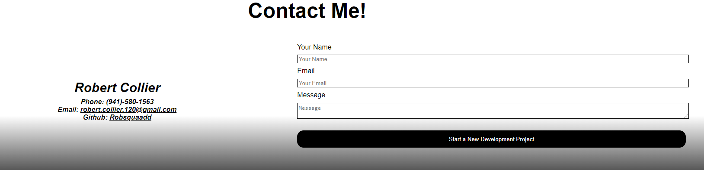

# Project Name: Portfolio

# Description:

This project displays and will continue to display all of my best devleopment work so
that employers have evidence of the quality of work that I put out.

Some of the elements that are in this project include:
-- A header that contains links that navigate to different sections on the page
-- A responsive layout that adapts to different screen sizes using flexbox and media queries.
-- A contact me section that gives potential employers or clients a way to contact me including a form that can be made to submit information.
-- An about me section that gives viewers a glimpse into what I am about.
-- A portfolio section that displays my best projects.

# Screenshots:

https://robsquaadd.github.io/robert-collier-portfolio/
